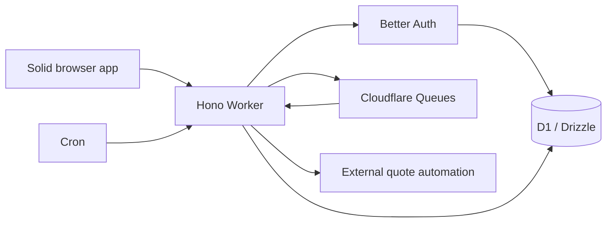

# Oxytype architecture

Package versions come from the workspace manifests and lockfile.

## Repository map

| Path | Role |
| --- | --- |
| `frontend/` | Browser app, static assets, Vite build, Storybook, frontend tests |
| `backend/` | HTTP API, workers, persistence, API docs, backend tests |
| `packages/contracts/` | Shared typed API contracts |
| `packages/schemas/` | Shared Zod schemas and domain types |
| `packages/util/`, `packages/funbox/`, `packages/challenges/` | Shared helpers and typing features |
| `packages/oxlint-config/`, `packages/typescript-config/`, `packages/tsdown-config/` | Shared tooling configuration |
| `packages/release/` | Daily production release helpers |
| `.github/workflows/` | CI, production releases, labeling, and repository automation |

The root is a private pnpm workspace. Node, TypeScript and Turborepo coordinate
package builds. Internal packages use the `@oxytype` scope.

## Frontend

Vite builds the browser app; SolidJS renders its `.tsx` UI. Solid Router owns route matching, links, URL state, and browser history. `components/AppRouter.tsx` mounts the router; `navigation/routes.ts` defines routes. `components/core/NavigationRuntime.tsx` connects routing to auth redirects, startup loading, active-test guards, and page lifecycles/animations. Page owners and typing-test refs stay cached across navigation.

Tailwind CSS supplies utility classes and semantic theme colors; compatibility CSS retains theme/funbox selectors. Icons use the `Fa` component. The app also uses TanStack Query/DB for data access, Chart.js for graphs, Better Auth clients for account authentication, and a service worker for offline assets.

Internal anchors use `Link` (or `Button` with `router-link`), which marks them for Solid Router's native anchor handling. Modified clicks, downloads, and external links retain browser behavior. Imperative callers use `navigation/navigation.ts`: `navigate()` awaits page transitions; `replaceUrl()` updates filters/deep links without a page transition or history entry. Forced navigation bypasses busy-page guards, but cannot leave an active `no_quit` test. Auth redirects replace the requested URL rather than adding a redirect history entry.

`AnimatedModal` uses `hidden open:flex`: the native dialog's `open` attribute controls wrapper visibility, including exit animations. Imperatively adding `hidden` to its class string is unsafe because reactive wrapper updates can erase it, leaving a transparent, closed dialog intercepting clicks. Overlay detection reads component-owned rectangles, so such a wrapper also blocks restart and command-line shortcuts. Regression coverage includes theme and saved-custom-theme preview dismissal, font selection, repeated opens, chained modals, and non-modal dialogs.

Useful entry points: `frontend/src/index.html`, `frontend/src/ts/index.ts`, `frontend/src/ts/components/`, and `frontend/vite.config.ts`. `frontend/src/ts/ape/` is the API client layer. `frontend/src/ts/test/` contains the typing test engine, not only automated tests.

## Backend and data

Hono runs on a Cloudflare Worker. Shared ts-rest contracts and Zod schemas define
request/response shapes. Drizzle describes D1 tables; Better Auth uses the SQLite
adapter for Google/GitHub accounts and database-backed sessions. `worker.ts`
exports fetch, queue and scheduled handlers with invocation-scoped bindings.
ApeKeys use versioned SHA-256 hashes and constant-time comparison. See
[the hash audit](CLOUDFLARE_OPERATIONS.md#apekey-hash-compatibility) before
restoring API-key records.

`api/hono-adapter.ts` preserves transport-independent controllers. D1 owns data,
exact rate windows, result progression and rankings. User
JSON writes use optimistic version guards inside atomic batches. An outbox and
scheduled-job ledger feed Cloudflare Queues; Cron recovers missed deliveries.
Reward grants and inbox claims deduplicate retries.

Docs/config/quote assets use the Worker ASSETS binding. Quote git automation
requires an external HTTPS bridge. Structured console logs
feed Workers observability. Use Cloudflare Analytics and logs for diagnostics.
Public aggregates and `/users/stats` remain database-backed application features.

## Development and delivery

Node/pnpm build workspace packages and API docs. Wrangler runs local workerd
and D1 on port 5005; Solid/Vite runs on port 3000. Application and test IDs are
strings. Vitest covers controllers and real D1 behavior.
Backend build performs a Wrangler dry-run; deployment applies migrations then
uses Wrangler. Docker publishes the static frontend only.

The default Wrangler config targets staging. A separate production config serves
frontend and API
on `oxytype.voltcrash.com` with isolated D1, queues, GitHub OAuth and Turnstile
credentials.
See [production setup](PRODUCTION_SETUP.md) for explicit build/deploy commands.
Built-in [anticheat](ANTICHEAT.md) checks scores and telemetry in all modes;
review its client-trust limits. See [operations](CLOUDFLARE_OPERATIONS.md)
for setup, recovery and deployment checks.

## Oxytype ownership boundaries

The fork uses its own production auth secret, GitHub OAuth app, Turnstile widget
and API endpoint at [oxytype.voltcrash.com](https://oxytype.voltcrash.com). Other
optional integrations need deployment-owned credentials before enabling them.
Public contact and security reporting use the Oxytype repository and its security
policy. The
original GPL license and contributor attribution remain in place.

See [development setup](./CONTRIBUTING_ADVANCED.md) and [security reporting](./SECURITY.md) for operational details.
