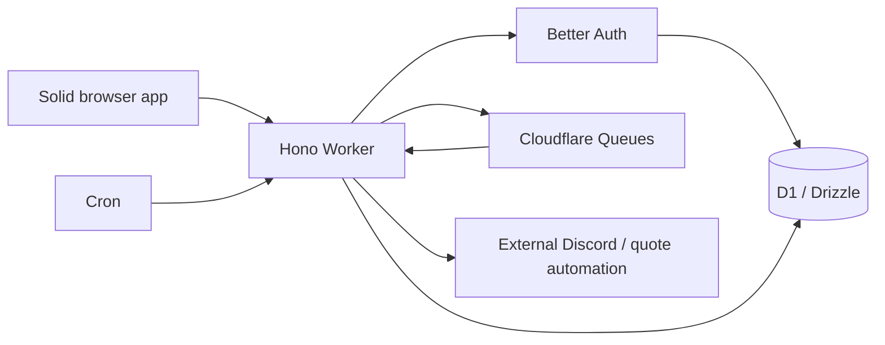

# Oxytype architecture

Snapshot: 3 October 2026. Package versions come from the workspace manifests and lockfile. This describes the codebase, including inherited architecture; Oxytype branding and deployment ownership are being updated in separate PRs.

## Repository map

| Path | Role |
| --- | --- |
| `frontend/` | Browser app, static assets, Vite build, Storybook, frontend tests |
| `backend/` | HTTP API, workers, persistence, API docs, backend tests |
| `packages/contracts/` | Shared typed API contracts |
| `packages/schemas/` | Shared Zod schemas and domain types |
| `packages/util/`, `packages/funbox/`, `packages/challenges/` | Shared helpers and typing features |
| `packages/oxlint-config/`, `packages/typescript-config/`, `packages/tsup-config/` | Shared tooling configuration |
| `packages/release/` | Release and deployment CLI |
| `docker/` | Static frontend container and build definition |
| `.github/workflows/` | CI, labeling, Docker publishing, and repository automation |

The root is a private pnpm workspace. Node 24, pnpm 12, TypeScript 7, and Turborepo 2 coordinate package builds. Internal package names currently carry the inherited scope; a separate PR renames that scope to Oxytype.

## Frontend

Vite 8 builds the browser app; SolidJS 1.9 renders its `.tsx` UI. Solid Router 1.0 owns route matching, links, URL state, and browser history. `components/AppRouter.tsx` mounts the router; `navigation/routes.ts` defines routes. `components/core/NavigationRuntime.tsx` connects routing to auth redirects, startup loading, active-test guards, and the existing page lifecycle/animations. Page owners and typing-test refs stay cached across navigation.

Tailwind CSS 4 supplies utility classes and semantic theme colors; compatibility CSS retains theme/funbox selectors. Icons use the `Fa` component. The app also uses TanStack Query/DB for data access, Chart.js for graphs, Better Auth clients for account authentication, and a service worker for offline assets.

Internal anchors use `Link` (or `Button` with `router-link`), which marks them for Solid Router's native anchor handling. Modified clicks, downloads, and external links retain browser behavior. Imperative callers use `navigation/navigation.ts`: `navigate()` awaits page transitions; `replaceUrl()` updates filters/deep links without a page transition or history entry. Forced navigation bypasses busy-page guards, but cannot leave an active `no_quit` test. Auth redirects replace the requested URL rather than adding a redirect history entry.

Useful entry points: `frontend/src/index.html`, `frontend/src/ts/index.ts`, `frontend/src/ts/components/`, and `frontend/vite.config.ts`. `frontend/src/ts/ape/` is the API client layer. `frontend/src/ts/test/` contains the typing test engine, not only automated tests.

## Backend and data

Hono runs on a Cloudflare Worker. Shared ts-rest contracts and Zod schemas define
request/response shapes. Drizzle describes D1 tables; Better Auth uses the SQLite
adapter for Google/GitHub accounts and database-backed sessions. `worker.ts`
exports fetch, queue and scheduled handlers with invocation-scoped bindings.

`api/hono-adapter.ts` preserves transport-independent controllers. D1 owns data,
exact rate windows, consumed OAuth state, result progression and rankings. User
JSON writes use optimistic version guards inside atomic batches. An outbox and
scheduled-job ledger feed Cloudflare Queues; Cron recovers missed deliveries.
Reward grants and inbox claims deduplicate retries. KV/DOs are unnecessary initially.

Docs/config/quote assets use the Worker ASSETS binding. Quote git automation and
Discord bot effects require an external HTTPS bridge. Structured console logs
feed Workers observability; `/stats/*` remains credential protected. Prometheus
and stats counters are isolate-local, not fleet-wide metrics.

## Development and delivery

Node 24/pnpm 12 build workspace packages and API docs. Wrangler runs local workerd
and D1 on port 5005; Solid/Vite runs on port 3000. MongoDB/Redis clients remain only
in offline export tools. Vitest covers existing controllers and real D1 behavior.
Backend build performs a Wrangler dry-run; deployment applies migrations then
uses Wrangler. Docker publishes the static frontend only.

The checked-in deployment targets a new, empty staging database and trusts
localhost:3000. Production OAuth/captcha/bridge credentials and a real anticheat
module are separate deployment inputs. See [operations](CLOUDFLARE_OPERATIONS.md)
for setup, recovery, cutover gates and the preserving importer.

## Oxytype ownership boundaries

The fork must use its own auth secret and OAuth applications, API endpoint, error reporting destination, Discord application, container registry, and release credentials before those integrations are enabled. The planned site `oxytype.voltcrash.com` and mailbox `contact@voltcrash.com` are not active. Until they are, public contact and security reporting use the Oxytype repository and its security policy. The original GPL license and contributor attribution remain in place.

See [development setup](./CONTRIBUTING_ADVANCED.md), [self-hosting](./SELF_HOSTING.md), and [security reporting](./SECURITY.md) for operational details.
