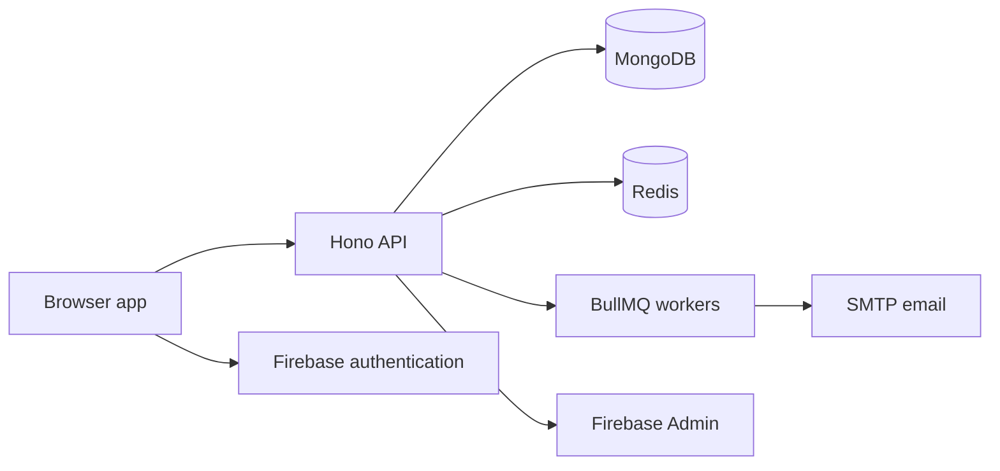

# Oxytype architecture

Snapshot: 1 October 2026. Package versions come from the workspace manifests and lockfile. This describes the codebase, including inherited architecture; Oxytype branding and deployment ownership are being updated in separate PRs.

## Repository map

| Path | Role |
| --- | --- |
| `frontend/` | Browser app, static assets, Vite build, Storybook, frontend tests |
| `backend/` | HTTP API, workers, persistence, email, API docs, backend tests |
| `packages/contracts/` | Shared typed API contracts |
| `packages/schemas/` | Shared Zod schemas and domain types |
| `packages/util/`, `packages/funbox/`, `packages/challenges/` | Shared helpers and typing features |
| `packages/oxlint-config/`, `packages/typescript-config/`, `packages/tsup-config/` | Shared tooling configuration |
| `packages/release/` | Release and deployment CLI |
| `docker/` | Compose stack and container definitions |
| `.github/workflows/` | CI, labeling, Docker publishing, and repository automation |

The root is a private pnpm workspace. Node 24, pnpm 11, TypeScript 7, and Turborepo 2 coordinate package builds. Internal package names currently carry the inherited scope; a separate PR renames that scope to Oxytype.

## Frontend

Vite 8 builds the browser app. SolidJS 1.9 powers newer `.tsx` components, while substantial older UI and controller code remains vanilla TypeScript and HTML. The two styles run together, so a feature may cross a Solid component, a legacy controller, and shared state.

Tailwind CSS 4 supplies utility classes and semantic theme colors. Existing Sass styles still cover much of the legacy app. Font Awesome 5 is used in legacy markup; new components use the `Fa` component. The app also uses TanStack Query/DB for data access, Chart.js for graphs, Firebase client SDKs for account authentication, and a service worker for offline assets.

Useful entry points: `frontend/src/index.html`, `frontend/src/ts/index.ts`, `frontend/src/ts/ready.ts`, `frontend/src/ts/components/`, and `frontend/vite.config.ts`. `frontend/src/ts/ape/` is the API client layer. `frontend/src/ts/test/` contains the typing test engine, not only automated tests.

## Backend and data

Hono serves the API through `@hono/node-server`. `@ts-rest` contracts and Zod schemas are shared with the frontend, so request and response shapes live in workspace packages. The backend uses MongoDB for durable records, Redis for cache/coordination, and BullMQ for background jobs. Firebase Admin handles account identity. Nodemailer and MJML render account emails. Redocly builds API documentation; Hono stats and Prometheus metrics provide operational visibility.

`backend/src/api/hono-adapter.ts` registers all 93 contract endpoints directly
with Hono. It uses ts-rest core inference and Zod validation while controllers
receive a transport-independent `MonkeyRequest`. Native Hono middleware handles
authentication, configuration/permission gates, in-memory rate limits, error
responses, security headers, and versioned conditional ETags.

The stats dashboard lives at `/stats/ui`, JSON summaries at
`/stats/swagger-stats`, and Prometheus exposition at `/stats/metrics`. Production
requires Basic authentication using `STATS_USERNAME` and `STATS_PASSWORD`; stats
remain available during maintenance. These replace Swagger Stats: its dashboard,
JSON structure, and generated metric names are no longer used. HTTP metrics are
`api_http_requests_total` and `api_http_request_duration_seconds`; existing domain
metrics are exposed from the same prom-client registry. Update external dashboards
that relied on Swagger Stats names or JSON fields. Missing production credentials
leave stats inaccessible.

Start with `backend/src/server.ts`, `backend/src/app.ts`, `backend/src/api/`, `backend/src/dal/`, `backend/src/services/`, and `backend/src/queues/`. The `dal` directory handles database access; services and workers handle work outside a single request.

## Development and delivery

- `pnpm install` installs all workspace dependencies. The root scripts use Turborepo to build packages before dependent apps.
- `pnpm dev-fe` starts the frontend on port 3000. The backend also needs MongoDB, Redis, environment settings, and account configuration for full functionality.
- Vite produces the frontend bundle. The backend compiles TypeScript and generates OpenAPI/Redocly docs. Docker serves the frontend through nginx, routes `/api` through Traefik, and runs the backend with MongoDB and Redis.
- Vitest holds unit and integration tests. Oxlint, Oxfmt, Stylelint, asset checks, and GitHub Actions cover code quality. CI work is being adapted for Oxytype ownership.

## Oxytype ownership boundaries

The fork must use its own Firebase project, API endpoint, error reporting destination, email sender, Discord application, container registry, and release credentials before those integrations are enabled. The planned site `oxytype.voltcrash.com` and mailbox `contact@voltcrash.com` are not active. Until they are, public contact and security reporting use the Oxytype repository and its security policy. The original GPL license and contributor attribution remain in place.

See [development setup](./CONTRIBUTING_ADVANCED.md), [self-hosting](./SELF_HOSTING.md), and [security reporting](./SECURITY.md) for operational details.
